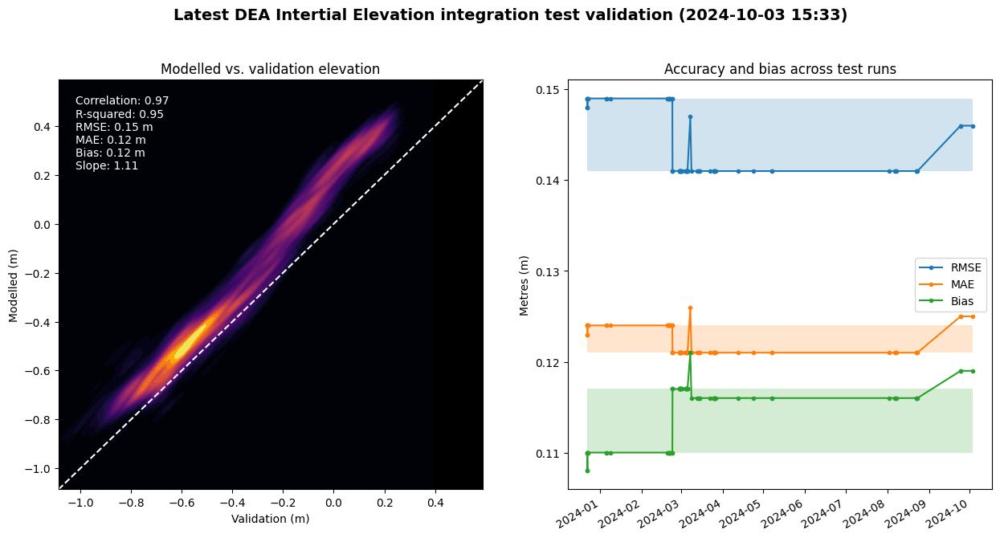

Integration tests
=================

# Latest results

> [!NOTE]  
> *This readme is automatically generated by the ``test_dem_accuracy`` function within [``test_intertidal.py``](../tests/test_intertidal.py).*

This directory contains tests that are run to verify that DEA Intertidal code runs correctly. The ``test_intertidal.py`` file runs a small-scale full workflow analysis over an intertidal flat in the Gulf of Carpentaria using the DEA Intertidal [Command Line Interface (CLI) tools](../notebooks/Intertidal_CLI.ipynb), and compares these results against a LiDAR validation DEM to produce some simple accuracy metrics.

The latest integration test completed at **2024-08-07 16:18**. Compared to the previous run, it had an:
- RMSE accuracy of **0.14 m ( :heavy_minus_sign: no change)**
- MAE accuracy of **0.12 m ( :heavy_minus_sign: no change)**
- Bias of **0.12 m ( :heavy_minus_sign: no change)**
- Pearson correlation of **0.975 ( :heavy_minus_sign: no change)**

